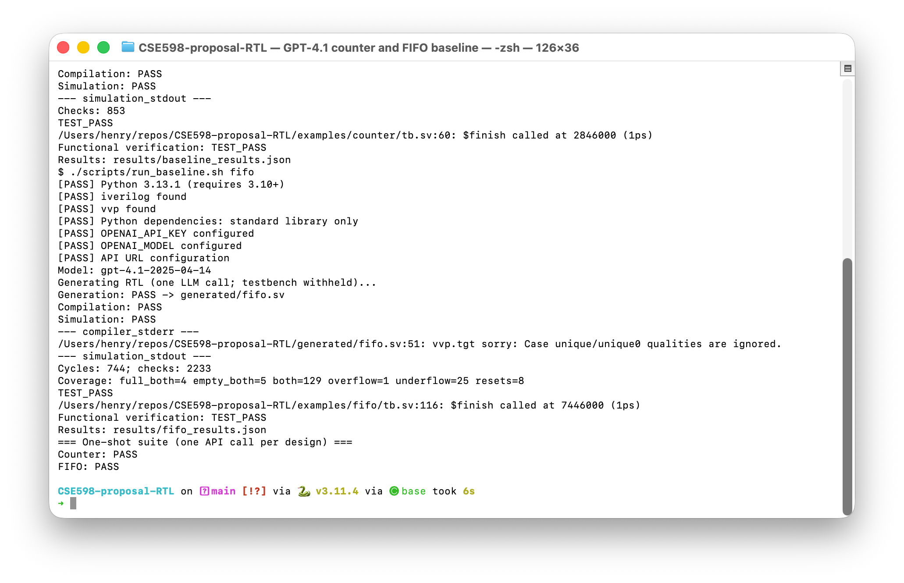

## Basic Information

**Student name:** Yaotian Liu\
**Project title:** RTLRepair-Agent: Verification-Guided Agentic RTL Generation\
**Repository / notebook link:** https://github.com/ytliu74/rtlrepair-agent\
**Configuration location:** `README.md`, `.env.example`, and `examples/`.

## Section 1. Problem Definition

For an RTL designer, convert a natural-language specification and fixed module
interface into synthesizable SystemVerilog. An independent testbench evaluates
the output. Success requires compilation and simulation exit codes of zero,
an explicit `TEST_PASS`, and no `TEST_FAIL`. Syntax/interface errors, timeouts,
mismatches, and missing pass markers are failures. Research question: can compiler
and simulator feedback improve an LLM's functional pass rate over one-shot generation?

## Section 2. Motivation and Project Scope

Generated RTL can contain syntax, timing, and functional errors. Compiler
diagnostics and simulation mismatches provide objective feedback for an agentic
generate–observe–repair workflow. Open-source Icarus Verilog makes evaluation
feasible within a semester. Implemented now: one-shot generation and automated
verification on a counter and FIFO. Planned: bounded repair and broader
evaluation. Synthesis/PPA feedback is a stretch goal; physical design is outside
the initial scope.

## Section 3. Runnable Baseline

Python 3.10+ calls OpenAI's pinned `gpt-4.1-2025-04-14` snapshot once per design,
cleans/saves the response, compiles with `iverilog -g2012`, and simulates with
`vvp`. The model sees only the specification/interface; testbenches are withheld.
`src/llm_client.py`, `rtl_generator.py`, `simulator.py`, and `baseline.py` implement
the pipeline. `./scripts/run_examples.sh` runs both tasks with two calls total.
This control baseline performs no feedback-driven repair or automatic retry.

## Section 4. Test Case and Baseline Output

The counter checks synchronous reset, enable/hold, and 8-bit wrap. The more complex
FIFO stores sixteen 8-bit words, with registered reads, occupancy/full/empty,
ordering, and pointer wrap. At full, simultaneous read/write accepts both; at
empty it accepts only the write, with no bypass. An independent shift-queue
scoreboard checks directed boundaries and 512 deterministic stimulus cycles.

Both designs compiled, simulated, and emitted **TEST_PASS** on September 6, 2026,
including fresh-clone reruns. First counter: 853 checks, 1.985 s generation,
329 tokens. First FIFO: 744 cycles, 2,233 checks, 3.478 s, 1,099 tokens.
FIFO compilation emitted a nonfatal ignored-`unique case` warning.
`generated/{counter,fifo}.sv`, `results/{baseline,fifo}_results.json`, and
`artifacts/{baseline,fifo}_output.txt` preserve the actual outputs.
Earlier GPT-5.6 evidence is archived.

{width=6.2in}

## Section 5. Reproducibility and Run Instructions

Clone the repository above and enter `rtlrepair-agent`. Install Python 3.10+
and Icarus Verilog (`brew install icarus-verilog` on macOS). Run
`python3 -m venv .venv`, `source .venv/bin/activate`, and
`python -m pip install -r requirements.txt` (standard library only).
Copy `.env.example` to `.env`; fill `OPENAI_API_KEY` and retain
`OPENAI_MODEL=gpt-4.1-2025-04-14`. Optional `OPENAI_BASE_URL` defaults to
`https://api.openai.com/v1`. Run `./scripts/run_examples.sh`. Each `examples/<task>/`
contains `spec.txt` and `tb.sv`; outputs are listed above. API model access is
required. README supplies Linux setup and offline verification; 20 tests pass.

## Section 6. Initial Evaluation Plan

Compare one-shot generation with bounded verification-guided repair using the
same model, initial prompt, tasks, and independent testbenches over repeated
trials. Primary metric: functional pass rate. Also measure compile rate,
iterations, calls, tokens, latency, and measurable cost. Include budget-matched
independent resampling. Expand curated examples before considering VerilogEval
or RTLLM. Retain all failed runs.

## Section 7. Limitations and Next Steps

Two tasks cannot establish generality or a model ranking; state comparisons are
not separate design tasks. Simulation covers only tested behavior and does not
prove synthesizability. Model nondeterminism, API availability, and testbench
coverage limit reliability. Next: implement diagnosis and bounded repair, expand
evaluation, and optionally incorporate synthesis/PPA feedback.
